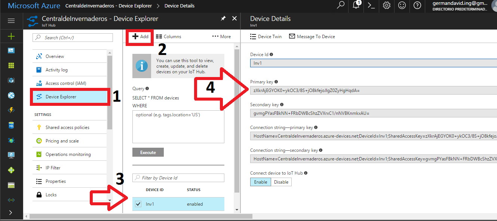

# Como usar Azure

Un breve tutorial para usar el computador como interfaz para mandar mensajes al IoT hub.


## Procedimiento

1.	Crear una cuenta de Azure
2.	Crear un servicio de IoThub https://docs.microsoft.com/en-us/azure/iot-hub/iot-hub-csharp-csharp-getstarted (En la sección: Create an IoT hub) (No olvidar crear un dispositivo).
3.	Crear un servicio de stream analitics https://docs.microsoft.com/en-us/azure/stream-analytics/stream-analytics-get-started-with-azure-stream-analytics-to-process-data-from-iot-devices (En la sección: Create a Stream Analytics Job) colocando como entrada el IoT hub  y como salida el power bi.
4.	Modificar el código [SendData.cs](SendData.cs) según las características de su proyecto.
5.	Compilar y ejecutar en Visual Studio el código modificado [SendData.cs](SendData.cs) para pruebas.

## Como añadir dispositivos al IoT hub?

Desde el azure portal, en la ventana principal del IoT hub se encontrará un panel en donde se puede encontrar el Device Explorer (1 en la imagen). Al dar clic aparecerá una interface que habilitará el botón Add (2 en la imagen) y desde ahí se podrá añadir un dispositivo. Es importante tener en cuenta el deviceid que después se colocara en el archivo [SendData.cs](SendData.cs) en la variable deviceID.
Luego de agregar el dispositivo aparecerá en la lista (3 en la imagen) y al dar click aparecerá toda la información de conexión, en este caso solo necesitaremos el Primary key (4 en la imagen) para modificar en el archivo [SendData.cs](SendData.cs) en la variable deviceKey.



## Como modificar [SendData.cs](SendData.cs)?

Cambiar estas lineas en codigo con su informacion del IoT hub creado. (No olvidar crear un dispositivo)
```csharp
static string iotHubUri = "MarkApp.azure-devices.net"; //Change this value for your own IoTHUB URL.
static string deviceKey = "eakY4ck3pWtSRCjdevbX/MfFtyPkI4SdgZjqGOmzwqY="; //Change this value for your own device key.
static SerialPort _serialPort;
static string deviceID = "myFirstDevice"; //Change this value for your device id
```

Cambiar estas lineas con su informacion del Puerto serial.
```csharp
_serialPort.PortName = "COM3"; //Change this value for your own serial port.
_serialPort.BaudRate = 9600; 	//Change this value for your own BaudRate.
```

Identificar cuáles son las variables que va a enviar desde su dispositivo, en este caso es temperatura interna, temperatura externa y humedad. Por lo que se crearon las siguientes variables.
```csharp
double tempint = 0;
double tempout = 0;
double humy = 0;
```

Identifique cuantos dígitos son necesarios para sus variables, en este caso son necesarios 3 digitos por cada variable y un digito adicional de identificación por lo que la trama se ve de la siguiente manera. ‘T000T000H000’ en el caso de que las variables sean 0. En total los caracteres necesarios para el envio de la información son 12. Modifique la línea que se muestra a continuación con el numero de dígitos que se necesitan según sea su caso. 
```csharp
var buffer = new char[12]; // Cambiar el 12 por el numero identificado
```

El programa le solicitara al micro-controlador los datos enviándole una T mayúscula. Posteriormente los datos son guadados en un arreglo llamado buffer para la decodificación.
```csharp
_serialPort.Write("T");
_serialPort.Read(buffer, 0, 12);
```

Por ultimo modifique la variable JSON según su información. En este caso son 3 variables: Temparatura interna, temperatura externa y húmedad por lo que esta variable queda de la siguiente forma.
```csharp
var telemetryDataPoint = new
	                {
	                    deviceId = "deviceID",
	                    internalTemp = tempint,
	                    externalTemp = tempout,
	                    humidity = humy
	                };
```
A la derecha están los nombres de las variables que se crearon para recibir los datos del microcontrolador, y a la izquierda están los nombres con los que serán recibidos estos valores en el IoT hub (Estos nombres los define el creador del archivo, lo mejor es colocar nombres acordes a las variables)

Por ultimo, las líneas que definen cuando se envían los mensajes al IoT hub se muestran a continuación:
```csharp
await deviceClient.SendEventAsync(message);
Console.WriteLine("{0} > Sending message: {1}", DateTime.Now, messageString);
Task.Delay(1000).Wait();
```
El delay es para indicarle cada cuanto se van a enviar, en este caso cada segundo. Se puede modificar y colocar un condicional que envié el mensaje solo cuando se identifique un comportamiento en las variables, por ejemplo si la temperatura externa exedio los 70°  el nuevo código seria:
```csharp
If(tempint>70){
				await deviceClient.SendEventAsync(message);
                Console.WriteLine("{0} > Sending message: {1}", DateTime.Now, messageString);
				}

Task.Delay(1000).Wait();
```

El delay representa el tiempo de muestreo de los datos, es necesario definirlo en la aplicacion para no ocupar el procesador del micro-controlador enviando solo datos aunque no se envíen siempre los mensajes a la nube.
